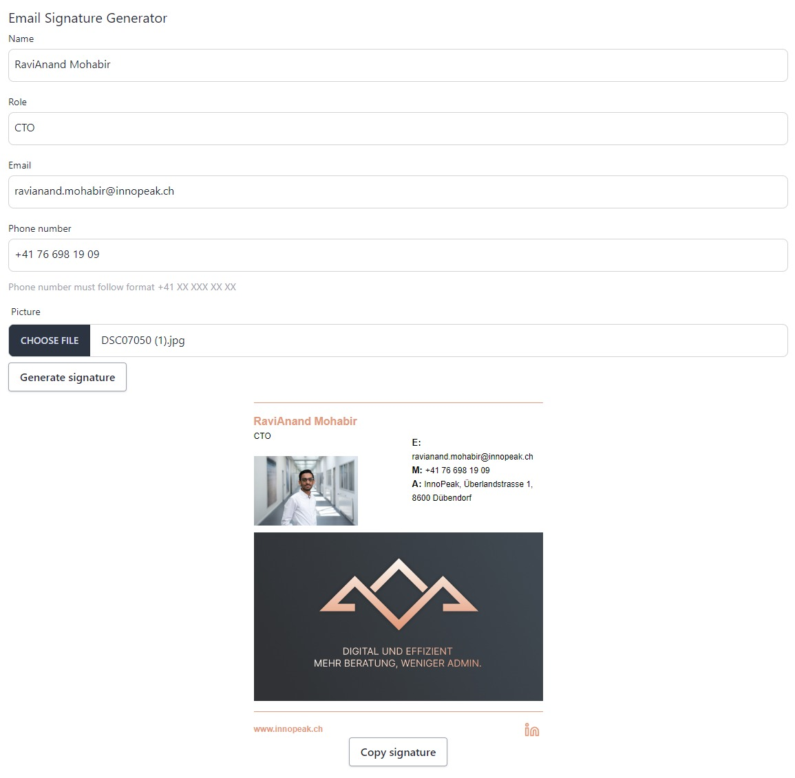

# GoMailMark

A Go web application to generate email signatures and host uploaded images with S3.

GoMailMark allows users to enter information about them, uploads given images to S3, and generates an HTML signature using [Templ](https://templ.guide/).

## Features

- [x] Generate email signatures based on a [Templ](https://templ.guide/).
- [x] Upload image files to S3.
- [x] 12-factor configuration.
- [ ] Easy deployment with Docker.

## Screenshots



## Usage

To use GoMailMark you'll need to create an S3-compatible bucket to which images will be uploaded. MinIO is supported.

GoMailMark runs a Go server and requires some configuration beforehand via environment variables pre-fixed with `MAIL_MARK_` or a `config.json`/`config.yml` in the current working directory.

To start the server run `go run main.go` and head to [`localhost:8000`](http://localhost:8000). The default port can be configured via the configuration key `server.port`.

If you want to programmatically use GoMailMark, you can send HTTP POST requests to `/` with a multi-part form data containing the following fields:

1. `name` - Your name.
2. `email` - Your email address.
3. `email` - Your email address.
4. `phone` - Your phone number.
5. `linkedin` - Your LinkedIn URL.
6. `picture` - A file containing an image to be uploaded to S3.

GoMailMark is designed to be forked and updated to your needs. The fields in the signature as well as its overall design can be easily modified. GoMailMark simply provides a web server and the S3 upload functionality for convenience.

## Configuration

GoMailMark can be configured using various configuration formats, for example your `config.yml` could look like this:

```yml
s3:
  host: localhost:9005
  accessKeyId: minioadmin
  secretAccessKey: minioadmin
  bucket: email-signature-generator
signature:
  company:
    name: Your Company Name
    url: https://example.com
    address:
      street: Street
      number: Nr
      zip: Zip
      area: Area
  brandColor: "#hexCode"
```

GoMailMark will use these variables to connect to S3 and provide default values to the template for your brand.
